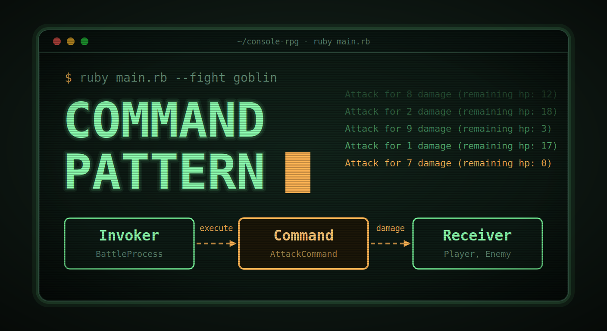

+++
date = '2026-09-21T00:00:00+02:00'
title = 'Command Pattern in Ruby: Turning Every Fight Action into an Object'
author = 'Genry Wood'
tags = ['pattern', 'command', 'ruby', 'rpg', 'game', 'console']
+++



## My fight had nowhere to live

Right after finishing my [previous article about the State pattern](), I'm rushing to write about another pattern that turned out to be a good fit for this game.

When the menu was sorted out, it was time for the part of the game where things actually happen: the fight. Until then it was only a stub in `MenuContext`.


```ruby
def start_fight_process
  puts 'The fight has started! (stub)'
end
```

The fight in my game is an auto-battle. I pick a monster, press the button, and from that moment the player and the monster do something every second until one of them dies. No input during the fight.

The first thing that comes to mind looks like this.

```ruby
until player.hp <= 0 || enemy.hp <= 0
  enemy.hp -= player.strength
  break if enemy.hp <= 0

  player.hp -= enemy.strength
  sleep(1)
end
```

For one action, it's fine. But I already knew it wouldn't stay that way. Damage with a random spread, defense, different monsters doing different things: every new rule means one more branch inside the same loop. Sooner or later that loop becomes the place where the whole game lives.

That's the same story as with my menu, just in a different place, and I didn't want to walk through it twice. So I looked at the [Command pattern](https://refactoring.guru/design-patterns/command/ruby/example): every action becomes its own object.


## The Solution: Command pattern and its roles (Command, Concrete Commands, Invoker, Receiver)

The idea of Command pattern is simple: every action becomes its own object with one method, execute. The object knows everything it needs to do its job: who acts, on whom and how. The one who runs it doesn't have to know any of that.

Class roles:

**Command**:

- A contract that every action has to follow.
- My classes: `Modules::Commands::Command`.

**Concrete Command:**
- One action, one class. Everything about the action lives in it.
- My classes: `Modules::Commands::AttackCommand`.

**Invoker:**
- The one who runs the command without knowing what is inside.
- My classes: `Modules::Battle::BattleProcess`.

**Receiver:**
- The object the action is applied to.
- My classes: `Models::Player, Models::Enemy`.

### Command

```ruby
# frozen_string_literal: true

module Modules
  module Commands
    class Command
      # @abstract
      def execute
        raise NotImplementedError, "#{self.class} has not implemented method '#{__method__}'"
      end
    end
  end
end
```

Any action must have execute, and if I forget it in a new command, I get a clear error right away.

### Concrete Command

```ruby
# frozen_string_literal: true

module Modules
  module Commands
    class AttackCommand < Command
      VARIANCE = 0.2 # +-20%

      def initialize(actor, target)
        @actor = actor
        @target = target
      end

      def execute
        raw_damage = randomized_damage
        mitigated_damage = [raw_damage - @target.defense_rating, 0].max
        @target.hp -= mitigated_damage

        Helpers::Locales::ATTACK_RESULT % { damage: mitigated_damage, hp: [@target.hp, 0].max }
      end

      private

      def randomized_damage
        base = @actor.attack_rating
        multiplier = 1 + rand(-VARIANCE..VARIANCE)
        (base * multiplier).round
      end
    end
  end
end
```

The command gets the actor and the target through the constructor, so it has everything it needs to work.

**Key points of the class:**
- everything about an attack lives in one file: the random spread and the defense that reduces the damage
- it doesn't care who attacks. The player and the monster use the same class

### Invoker

```ruby
def resolve_tick
  @log.clear

  player_command = @player.strategy.decide(@player, @enemy)
  @log << player_command.execute
  return if battle_over?

  enemy_command = @enemy.strategy.decide(@enemy, @player)
  @log << enemy_command.execute
end
```

This is the part I like the most. `BattleProcess` has no idea what an attack is. It takes a command, calls execute and puts the result to the log. If I add a new action tomorrow, this method stays the same.
Which command to create is decided by the strategy of each fighter.

### Receiver

Receivers are my plain models `Player` and `Enemy` with hp, `attack_rating` and `defense_rating`. The command doesn't copy their logic, it only works with their data.


## Conclusions

In this article I showed how I turned the actions of my auto-battle into objects with the Command pattern.

What I got out of it:
- every action is an object with one method, execute;
- everything about an attack lives in one class, and the player and the monster use the same one;
- BattleProcess doesn't know what an attack is, so a new action doesn't touch it;
