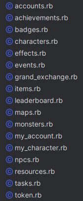

+++
date = '2026-01-10T00:00:00+02:00'
title = 'My first API wrapper'
author = 'Genry Wood'
tags = ['api', 'wrapper', 'ruby']
+++


# My First API wrapper

## The Problem
Once I had a desire to play [Artifacts MMORPG](https://www.artifactsmmo.com) in order to improve my skills in working with third-party 
APIs (yes, playing this game you can master or improve these skills).
Over time, I encountered a problem that I needed to write a lot of additional logic for handling requests,
errors, etc. I saw how people in community of this game create their own wrappers to make it easier to work
with this API, but all the wrappers were in other programming languages ( not Ruby ).
That's when I decided to learn more about wrappers and what are the best practices for writing them.

## Solution
I started looking for articles on how people usually write such wrappers in Ruby or other programming languages.
Having looked at quite large wrappers (payments or wrappers for working with social networks)
I got an approximate scheme of writing wrappers.

> PS. In the article I will mention many classes I have already written, so you can see the wrapper [code here](https://github.com/serbulovv/artifacts-api-client).

So every wrapper should have:

**Configuration Layer:**

* Responsible for storing global settings such as `api_key` and `base_url`. Provides secure and flexible client initialization.
* My classes: `ArtifactsApiClient::Configuration`, main `ArtifactsApiClient` module with configure method.

**Connection Layer:**

* Responsible for configuring HTTP settings using `Faraday` and defining how data is exchanged (e.g. JSON encoding/decoding). This means that it can be extended in the future to support other providers for http requests
* My classes: `ArtifactsApiClient::Connection`.

**Client Layer:**

* A central class that encapsulates the logic of executing requests (get, post, delete), adds the necessary headers (especially `Authorization`) and delegates error handling.
* My classes: `ArtifactsApiClient::Client`.

**Error Handling Layer:**

* Converts HTTP statuses (e.g. 404, 500) to specific, named Ruby exceptions (e.g. `CharacterNotFoundError`).
* My classes: `ArtifactsApiClient::ErrorsHandler` and all its specialized subclasses.

**Resource Layer:**

Provides a clean, idiomatic Ruby interface to the end user. These classes are thin wrappers that map logical methods (e.g. `get_all_badges`) to specific API URLs and pass them to the `Client` class.
My classes: `ArtifactsApiClient::Api::Achievements`, `ArtifactsApiClient::Api::Badges`, etc.

---

Next, I will explain the code I developed for each of these layers.

**Configuration Layer**

The code looks like this.

```ruby
module ArtifactsApiClient
  class Configuration
    BASE_API_URL = 'https://api.artifactsmmo.com/'

    attr_accessor :api_key, :base_url

    def initialize
      @api_key = ENV['ARTIFACTS_API_TOKEN']
      @base_url = BASE_API_URL
    end
  end
end
```

I would say that this is the base point for setting up all the settings.
Main tasks of this class to encapsulates the parameters that should be accessible from different
layers of the client:

`api_key` - authorization token for accessing a third-party API;
`base_url` - the base API address from which all endpoints are built.

Although **BASE_API_URL** is specified as a constant, base_url is an attr_accessor. This allows you to:

* replace the API endpoint (e.g. for a sandbox or staging environment);
* use a fake or local server in tests;
* not change the client code when changing the API infrastructure.

**Connection Layer:**

The code looks like this.

```ruby
# frozen_string_literal: true

module ArtifactsApiClient
 class Connection
   class << self
     def build
       Faraday.new(ArtifactsApiClient.configuration.base_url) do |f|
         f.request :json
         f.response :json, content_type: 'application/json'
         f.adapter Faraday.default_adapter
       end
     end
   end
 end
end
```

The current class is an entry point for creating HTTP connections and settings. It looks pretty “dumb” now,
but the main idea was to be able to choose the right HTTP request provider when needed.

The `.build` method encapsulates all of Faraday's initialization logic. This allows:
* The client (Client class) is independent of Faraday configuration details;
* if you change the HTTP library or settings, you only need to change this class.

**Error Handling Layer:**

The code for this class is quite long, so I'll just attach the highlights.

```ruby
# frozen_string_literal: true

require 'json'

module ArtifactsApiClient
 class ErrorsHandler < StandardError
   attr_reader :status, :body, :error_details

   def initialize(message = nil, status: nil, body: nil, error_code: nil)
     super(message)
     @status = status
     @body = body
     @error_code = error_code
     @error_details = parse_error(body)
   end

   def self.handle_error(response)
     code = response.body.is_a?(Hash) ? response.body["error"]["code"] : nil

     case response.status
       # General
     when 422 then raise InvalidPayloadError.new("Invalid Payload", status: 422, body: response.body, error_code: code)
     when 429 then raise TooManyRequestsError.new("Too Many Requests", status: 429, body: response.body, error_code: code)
     when 404 then raise NotFoundError.new("Not Found", status: 404, body: response.body, error_code: code)
      else
       raise self.new("Unexpected error", status: response.status, body: response.body, error_code: code)
     end
   end

   private

   def parse_error(body)
     return body unless body.is_a?(String)

     JSON.parse(body) rescue body
   end

   class InvalidPayloadError < ErrorsHandler; end
   class TooManyRequestsError < ErrorsHandler; end
   class NotFoundError < ErrorsHandler; end
 end
end
```

This class (layer) is quite primitive and has logical actions - to handle errors, or more precisely,
to handle errors from a third-party API. It converts HTTP statuses and error codes into specific
Ruby exceptions, so that later it can be conveniently handled. I consider this a rather important class,
because it directly affects the business logic that will be written for the application that will use this
wrapper. Using these errors, you can postpone the execution of some tasks, or perform some other business
actions.

If an error occurs, we catch the error code and interpret it into a normal, readable, and unique exception that can be handled. If the error code is unknown, we throw a more general exception.

**Client:**

The code looks like this.

```ruby
# frozen_string_literal: true

require 'json'

module ArtifactsApiClient
 class Client
   class << self
     def get(path, headers: {}, params: {})
       response = connection.get(path, params, default_headers.merge(headers))
       handle_response(response)
     end

     def post(path, headers: {}, params: {})
       response = connection.post(path, params.to_json, default_headers.merge(headers))
       handle_response(response)
     end

     def delete(path, headers: {})
       response = connection.delete(path, nil, default_headers.merge(headers))
       handle_response(response)
     end

     private

     def connection
       @connection ||= Connection.build
     end

     def default_headers
       {
         'Authorization' => "Bearer #{ArtifactsApiClient.configuration.api_key}",
         'Accept'        => 'application/json',
         'Content-Type'  => 'application/json'
       }
     end

     def handle_response(response)
       if (200..299).cover?(response.status)
         response.body
       else
         ErrorsHandler.handle_error(response)
       end
     end
   end
 end
end
```

This class is the central point for executing HTTP requests to a third-party API.
It encapsulates the logic of sending requests, adding headers, and processing responses.
In my understanding, the essence of this class is to collect all the previous configurations
and use them to universally execute certain actions. In my case, the actions are requests to
a third-party API. That is, the configuration of the API keys and the base URL has already been configured,
the connection provider has been specified, all that remains is to execute the requests, and if something
goes wrong, to handle these errors with the already created error handler.

Key points of the class:

**Using a shared HTTP connection**

```ruby
def connection
  @connection ||= Connection.build
end
```

The connection is created once and cached. This:
* reduces redundant initialization;
* guarantees a consistent configuration for all requests.

**Centralized headers by default**

```ruby
def default_headers
```

The method generates a standard set of headers:
* `Authorization` — Bearer token from global configuration;
* `Accept` — expected response format;
* `Content-Type` — request body format.

**Flexible expansion of headers and parameters**

Each public method accepts:

* `headers` — to add or redefine headings;
* `params` — for passing query parameters (**GET**) or the request body (**POST**).

This approach allows resource classes to remain simple and not to know the details of the HTTP layer.

Client class does not contain any business logic for specific resources and does not know anything about
the structure of API responses. Its role is to be a stable transport layer between resource classes and
the HTTP connection.

**Classes that have business logic**



All of these classes cover all the core logic of the Artifacts game.
The classes in the `ArtifactsApiClient::Api` namespace are responsible for providing a domain-aware,
idiomatic Ruby interface to third-party API endpoints. They translate the API business operations into
understandable methods without exposing the details of the HTTP layer.

General principles and responsibilities of these classes:

**Domain mapping to HTTP routes**

Each class in `Api::*` is responsible for a specific domain area (accounts, characters, items, etc.).
The methods of these classes directly represent API endpoints and their business semantics,
not the technical implementation details.

**No infrastructure logic**

Resource classes:
* do not know about Faraday;
* do not work with headers;
* do not handle errors;
* do not perform serialization or deserialization.

All infrastructure logic is delegated to the `Client` class.

**Thin and predictable methods**

Each method:

* builds the endpoint path;
* selects the HTTP method (GET, POST, DELETE);
* passes parameters without modification.

In addition to all the wrapper logic, I would also like to point out the **entry point** into the wrapper itself.
The code looks like this


```ruby
# frozen_string_literal: true

require 'zeitwerk'
require 'faraday'

module ArtifactsApiClient
 class << self
   attr_accessor :configuration

   def configure
     self.configuration ||= Configuration.new
     yield(configuration)
   end

   def configuration
     @configuration ||= Configuration.new
   end
 end
end

loader = Zeitwerk::Loader.for_gem
loader.setup
```

This code is responsible for initializing the API wrapper, managing global configuration, and autoloading classes. It forms the public entry point for the library user.

Through it:
* configuration is defined;
* all API resources are доступні;
* the internal structure of the library is hidden.

## Conclusions

With this article I wanted to show my understanding of writing simple wrappers for third-party APIs.
The [repository](https://github.com/serbulovv/artifacts-api-client) shows the general structure of writing such wrappers. One of the key requirements was to
create the most flexible solution possible: with support for dynamic configuration, the ability to pass
a base URL, replace HTTP transport, as well as with centralized and extensible error handling.
